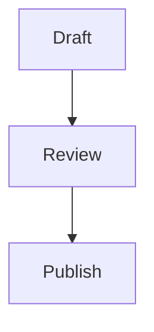

# Moondown


[English README](README_EN.md)

Moondown 是一个基于 CodeMirror 6 的无头 Markdown 编辑器。它提供了成熟的编辑核心，支持 Markdown 语法隐藏、斜杠菜单、气泡菜单、表格编辑、图片组件、Mermaid 图表、LaTeX 预览以及 AI 集成扩展点，同时保持与前端框架无关。

Moondown 是一个独立的开源项目，定位是嵌入到你的应用中，而不是提供固定的应用壳。

## 功能特性

- 基于 CodeMirror 6 的 Markdown 编辑
- 浅色与深色主题
- 语法隐藏，获得更清爽的写作体验
- 斜杠菜单
- 选区气泡菜单
- 行内格式：粗体、斜体、高亮、下划线、删除线、行内代码
- 标题、有序列表、无序列表、引用、分割线
- 可编辑 Markdown 表格
- 图片渲染与编辑
- Mermaid 代码块预览
- 基于 KaTeX 的 LaTeX 代码块预览
- 支持图片、Mermaid、LaTeX 组件的源码编辑
- AI 续写与润色扩展钩子
- 通过翻译覆盖实现国际化
- 插件 API（CodeMirror 扩展、生命周期钩子、自定义斜杠命令）
- 本地 playground 用于视觉 QA 与集成测试

## 安装

```bash
npm install moondown
```

或者：

```bash
pnpm add moondown
```

导入编辑器及样式：

```ts
import Moondown from 'moondown';
import 'moondown/style.css';
import 'tippy.js/dist/tippy.css';
```

`tippy` 样式用于表格辅助浮层。

## 快速开始

```ts
import Moondown from 'moondown';
import 'moondown/style.css';
import 'tippy.js/dist/tippy.css';

const container = document.querySelector('#editor');

if (!container) {
  throw new Error('Editor container not found');
}

const editor = new Moondown(container as HTMLElement, '# Hello Moondown', {
  theme: 'light',
  syntaxHiding: true,
  placeholder: 'Write something...',
  onChange: () => {
    console.log(editor.getValue());
  },
});
```

编辑器实例提供了简洁的命令式 API：

```ts
editor.getValue();
editor.setValue('# Updated');
editor.setTheme('dark');
editor.toggleSyntaxHiding(false);
editor.setReadOnly(true);
editor.focus();
editor.destroy();
```

## 基础 HTML

```html
<div id="editor"></div>
```

Moondown 会填充你提供的容器。请在应用内设置容器尺寸：

```css
#editor {
  min-height: 480px;
}
```

## Markdown 组件

### 图片

```md

```

图片组件支持选中、编辑、删除，并可在只读模式下受保护。

### Mermaid

````md

````

Mermaid 代码块会渲染为图表预览。点击预览可选中对应源码块进行编辑。

### LaTeX

````md
```latex
\int_0^1 x^2 dx = \frac{1}{3}
\sum_{i=1}^{n} i = \frac{n(n+1)}{2}
```
````

LaTeX 代码块按行渲染，多行源码会保持多行预览。

## 配置

```ts
import type { EditorConfig } from 'moondown';

const config: EditorConfig = {
  theme: 'light',
  syntaxHiding: true,
  placeholder: 'Start writing...',
  readOnly: false,
  locale: 'en',
  translations: {},
  onChange(update) {
    console.log(update.state.doc.toString());
  },
  onFocus() {
    console.log('focused');
  },
  onBlur() {
    console.log('blurred');
  },
};
```

### EditorConfig

| 选项 | 类型 | 默认值 | 说明 |
| --- | --- | --- | --- |
| `theme` | `'light' \| 'dark'` | `'light'` | 编辑器初始主题。 |
| `syntaxHiding` | `boolean` | `true` | 尽可能隐藏 Markdown 语法标记。 |
| `placeholder` | `string` | `''` | 空文档时展示的占位文本。 |
| `readOnly` | `boolean` | `false` | 禁止文档内容修改。 |
| `locale` | `string` | `'en'` | 内置 UI 与 AI 提示所用语言区域。 |
| `translations` | `Record<string, string>` | `{}` | UI 文案覆盖。 |
| `onAIStream` | `AIStreamHandler` | `null` | 流式 AI 提供方钩子。 |
| `plugins` | `MoondownPlugin[]` | `[]` | 用户插件列表。 |
| `onChange` | `(update) => void` | `undefined` | 文档变更后触发。 |
| `onFocus` | `() => void` | `undefined` | 编辑器获得焦点时触发。 |
| `onBlur` | `() => void` | `undefined` | 编辑器失去焦点时触发。 |

## AI 集成

Moondown 不内置托管 AI 服务。你需要提供一个 `onAIStream` 函数，并返回 `ReadableStream<string>`。

```ts
import Moondown, type AIStreamHandler from 'moondown';

const onAIStream: AIStreamHandler = async (systemPrompt, userPrompt, signal) => {
  const response = await fetch('/api/ai', {
    method: 'POST',
    headers: {
      'Content-Type': 'application/json',
    },
    body: JSON.stringify({ systemPrompt, userPrompt }),
    signal,
  });

  if (!response.ok || !response.body) {
    throw new Error(`AI request failed: ${response.status}`);
  }

  const reader = response.body.getReader();
  const decoder = new TextDecoder();

  return new ReadableStream<string>({
    async start(controller) {
      while (true) {
        const { done, value } = await reader.read();
        if (done) break;
        controller.enqueue(decoder.decode(value, { stream: true }));
      }
      controller.close();
    },
  });
};

new Moondown(document.querySelector('#editor') as HTMLElement, '', {
  onAIStream,
});
```

不要在浏览器端暴露模型服务商 API Key。请通过你自己的后端转发真实模型调用。

## 插件

插件可以贡献 CodeMirror 扩展、生命周期钩子和斜杠命令。

```ts
import { defineMoondownPlugin } from 'moondown';

const templatePlugin = defineMoondownPlugin({
  name: 'template-plugin',
  slashCommands: [
    {
      id: 'template.decision',
      title: 'Decision Note',
      icon: 'file-plus',
      keywords: ['decision', 'adr'],
      execute(view) {
        const pos = view.state.selection.main.from;
        view.dispatch({
          changes: {
            from: pos,
            insert: '## Decision\n\n- Context:\n- Options:\n- Outcome:\n',
          },
        });
      },
    },
  ],
});

new Moondown(document.querySelector('#editor') as HTMLElement, '', {
  plugins: [templatePlugin],
});
```

你也可以包装原生 CodeMirror 扩展：

```ts
import { createExtensionPlugin } from 'moondown';

const myPlugin = createExtensionPlugin('my-extension', myCodeMirrorExtension);
```

## 主题

Moondown 样式基于 CSS 自定义属性。你可以在应用层覆盖：

```css
:root {
  --color-primary-hsl: 211 100% 50%;
  --color-primary-light-hsl: 209 100% 72%;
  --color-primary-dark-hsl: 211 100% 42%;
}
```

这些变量会影响选区颜色、Markdown 标记、列表项目符号、链接、引用强调、组件、菜单和 AI 面板控件。

运行时切换主题：

```ts
editor.setTheme('dark');
```

## 国际化

通过 `translations` 覆盖内置 UI 文案：

```ts
new Moondown(container, '', {
  locale: 'zh-CN',
  translations: {
    'moondown.slash.heading1': '一级标题',
    'moondown.slash.insertTable': '插入表格',
    'moondown.ai.polish.buttons.retry': '重试',
    'moondown.ai.polish.buttons.copy': '复制',
    'moondown.ai.polish.buttons.insert': '插入',
    'moondown.ai.polish.placeholder': '描述你想如何润色选中文本...',
  },
});
```

## 开发

环境要求：

- Node.js `>= 22`
- pnpm `>= 10`

安装依赖：

```bash
pnpm install
```

运行本地 playground：

```bash
pnpm run dev
```

默认 playground 地址：

```text
http://localhost:5174
```

使用自定义端口：

```bash
PORT=5175 pnpm run dev
```

## 脚本

| 命令 | 说明 |
| --- | --- |
| `pnpm run check` | 进行 TypeScript 类型检查。 |
| `pnpm run build` | 构建 ESM、CJS、类型声明和 CSS 到 `dist/`。 |
| `pnpm run build:playground` | 构建静态 playground 到 `playground-dist/`。 |
| `pnpm run test:unit` | 运行单元测试。 |
| `pnpm run test:e2e` | 运行浏览器 E2E 测试。 |
| `pnpm run test:e2e:real-ai` | 运行可选的真实 AI 集成测试。 |
| `pnpm run test:ai:smoke` | 对 OpenAI 兼容 AI 接口做冒烟测试。 |
| `pnpm run test:full` | 类型检查 + 构建 + 单测 + E2E 全量测试。 |

## 测试

在提交 PR 或发布版本前，建议运行：

```bash
pnpm run test:full
```

AI 服务集成测试请先配置环境变量，再运行：

```bash
DEEPSEEK_ENDPOINT='https://example.com/openai/v1/' \
DEEPSEEK_MODEL='your-model' \
DEEPSEEK_API_KEY='your-key' \
pnpm run test:e2e:real-ai
```

## 发布

该包已配置为公开发布到 npm：

```json
{
  "main": "./dist/index.cjs",
  "module": "./dist/index.js",
  "types": "./dist/index.d.ts",
  "exports": {
    ".": {
      "types": "./dist/index.d.ts",
      "import": "./dist/index.js",
      "require": "./dist/index.cjs"
    },
    "./style.css": "./dist/style.css"
  },
  "files": ["dist", "README.md", "LICENSE"],
  "publishConfig": {
    "access": "public"
  }
}
```

### GitHub Actions 自动发布

仓库包含 `.github/workflows/publish.yml`。推送 `v1.0.0` tag 或手动触发 workflow 后，GitHub Actions 会依次执行依赖安装、类型检查、单元测试、构建、`npm pack --dry-run`，然后通过 `npm publish --access public --provenance` 发布到 npm。

npm 侧需要为该包配置 Trusted Publisher（推荐），或在 GitHub 仓库 secrets 中配置具备发布权限的 `NPM_TOKEN`。

推荐发布流程：

```bash
pnpm install
pnpm run test:full
npm login
npm whoami
npm version patch
npm pack --dry-run
npm publish --access public
```

如需升级次版本或主版本，可使用 `npm version minor` 或 `npm version major`。

如果你的 npm 账号或包开启了发布双重认证，发布时 npm 会提示输入 OTP。自动化发布场景建议使用具备发布权限的 granular npm token。

npm 官方参考：

- [创建并发布非 scoped 公共包](https://docs.npmjs.com/creating-and-publishing-unscoped-public-packages/)
- [创建并发布 scoped 公共包](https://docs.npmjs.com/creating-and-publishing-scoped-public-packages)
- [npm publish CLI 命令](https://docs.npmjs.com/cli/v11/commands/npm-publish)
- [为包发布开启 2FA](https://docs.npmjs.com/requiring-2fa-for-package-publishing-and-settings-modification)

## 包内容

发布后的 npm 包包含：

- `dist/index.js`
- `dist/index.cjs`
- `dist/index.d.ts`
- `dist/style.css`
- `README.md`
- `LICENSE`

发布前可通过以下命令确认打包文件：

```bash
npm pack --dry-run
```

## 贡献

欢迎提交 issue 和 pull request。请尽量保持改动聚焦，并为会影响编辑器输出、浏览器交互、组件行为或公共 API 的变更补充测试。

建议检查项：

```bash
pnpm run check
pnpm run test:unit
pnpm run test:e2e
```

## 许可证

Apache-2.0
