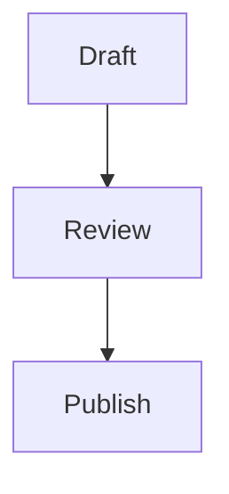

# Moondown


[中文 README](README.md)

Moondown is a headless Markdown editor built on CodeMirror 6. It gives you a polished editing core with Markdown syntax hiding, slash commands, bubble menus, table editing, image widgets, Mermaid diagrams, LaTeX previews, and AI integration hooks while staying framework-agnostic.

Moondown is an independent open source project. It is designed to be embedded into your own application rather than shipping a fixed application shell.

## Features

- CodeMirror 6 based Markdown editing
- Light and dark themes
- Syntax hiding for a cleaner writing experience
- Slash command menu
- Selection bubble menu
- Inline formatting: bold, italic, highlight, underline, strikethrough, inline code
- Headings, ordered lists, unordered lists, blockquotes, horizontal rules
- Editable Markdown tables
- Image rendering and editing
- Mermaid fenced code block previews
- LaTeX fenced code block previews powered by KaTeX
- Widget source editing for image, Mermaid, and LaTeX blocks
- AI continuation and AI polish hooks
- Internationalization through translation overrides
- Plugin API for CodeMirror extensions, lifecycle hooks, and custom slash commands
- Local playground for visual QA and integration testing

## Installation

```bash
npm install moondown
```

or:

```bash
pnpm add moondown
```

Import the editor and its styles:

```ts
import Moondown from 'moondown';
import 'moondown/style.css';
import 'tippy.js/dist/tippy.css';
```

The Tippy stylesheet is used by the table helper popovers.

## Quick Start

```ts
import Moondown from 'moondown';
import 'moondown/style.css';
import 'tippy.js/dist/tippy.css';

const container = document.querySelector('#editor');

if (!container) {
  throw new Error('Editor container not found');
}

const editor = new Moondown(container as HTMLElement, '# Hello Moondown', {
  theme: 'light',
  syntaxHiding: true,
  placeholder: 'Write something...',
  onChange: () => {
    console.log(editor.getValue());
  },
});
```

The editor instance exposes a small imperative API:

```ts
editor.getValue();
editor.setValue('# Updated');
editor.setTheme('dark');
editor.toggleSyntaxHiding(false);
editor.setReadOnly(true);
editor.focus();
editor.destroy();
```

## Basic HTML

```html
<div id="editor"></div>
```

Moondown fills the container you provide. Size the container in your app:

```css
#editor {
  min-height: 480px;
}
```

## Markdown Widgets

### Images

```md

```

Image widgets can be selected, edited, deleted, and protected in read-only mode.

### Mermaid

````md

````

Mermaid blocks render as diagram previews. Clicking the preview selects the source block for editing.

### LaTeX

````md
```latex
\int_0^1 x^2 dx = \frac{1}{3}
\sum_{i=1}^{n} i = \frac{n(n+1)}{2}
```
````

LaTeX blocks render line by line. Multi-line source stays multi-line in the preview.

## Configuration

```ts
import type { EditorConfig } from 'moondown';

const config: EditorConfig = {
  theme: 'light',
  syntaxHiding: true,
  placeholder: 'Start writing...',
  readOnly: false,
  locale: 'en',
  translations: {},
  onChange(update) {
    console.log(update.state.doc.toString());
  },
  onFocus() {
    console.log('focused');
  },
  onBlur() {
    console.log('blurred');
  },
};
```

### EditorConfig

| Option | Type | Default | Description |
| --- | --- | --- | --- |
| `theme` | `'light' \| 'dark'` | `'light'` | Initial editor theme. |
| `syntaxHiding` | `boolean` | `true` | Hides Markdown syntax where possible. |
| `placeholder` | `string` | `''` | Placeholder shown for an empty document. |
| `readOnly` | `boolean` | `false` | Prevents document mutations. |
| `locale` | `string` | `'en'` | Locale used by built-in UI and AI prompts. |
| `translations` | `Record<string, string>` | `{}` | UI text overrides. |
| `onAIStream` | `AIStreamHandler` | `null` | Streaming AI provider hook. |
| `plugins` | `MoondownPlugin[]` | `[]` | User plugins. |
| `onChange` | `(update) => void` | `undefined` | Runs after document changes. |
| `onFocus` | `() => void` | `undefined` | Runs when the editor receives focus. |
| `onBlur` | `() => void` | `undefined` | Runs when the editor loses focus. |

## AI Integration

Moondown does not ship with a hosted AI service. You provide an `onAIStream` function that returns a `ReadableStream<string>`.

```ts
import Moondown, type AIStreamHandler from 'moondown';

const onAIStream: AIStreamHandler = async (systemPrompt, userPrompt, signal) => {
  const response = await fetch('/api/ai', {
    method: 'POST',
    headers: {
      'Content-Type': 'application/json',
    },
    body: JSON.stringify({ systemPrompt, userPrompt }),
    signal,
  });

  if (!response.ok || !response.body) {
    throw new Error(`AI request failed: ${response.status}`);
  }

  const reader = response.body.getReader();
  const decoder = new TextDecoder();

  return new ReadableStream<string>({
    async start(controller) {
      while (true) {
        const { done, value } = await reader.read();
        if (done) break;
        controller.enqueue(decoder.decode(value, { stream: true }));
      }
      controller.close();
    },
  });
};

new Moondown(document.querySelector('#editor') as HTMLElement, '', {
  onAIStream,
});
```

Do not expose provider API keys in browser code. Route real model calls through your own backend.

## Plugins

Plugins can contribute CodeMirror extensions, lifecycle hooks, and slash commands.

```ts
import { defineMoondownPlugin } from 'moondown';

const templatePlugin = defineMoondownPlugin({
  name: 'template-plugin',
  slashCommands: [
    {
      id: 'template.decision',
      title: 'Decision Note',
      icon: 'file-plus',
      keywords: ['decision', 'adr'],
      execute(view) {
        const pos = view.state.selection.main.from;
        view.dispatch({
          changes: {
            from: pos,
            insert: '## Decision\n\n- Context:\n- Options:\n- Outcome:\n',
          },
        });
      },
    },
  ],
});

new Moondown(document.querySelector('#editor') as HTMLElement, '', {
  plugins: [templatePlugin],
});
```

You can also wrap a raw CodeMirror extension:

```ts
import { createExtensionPlugin } from 'moondown';

const myPlugin = createExtensionPlugin('my-extension', myCodeMirrorExtension);
```

## Theming

Moondown styles are based on CSS custom properties. You can override them at app level:

```css
:root {
  --color-primary-hsl: 211 100% 50%;
  --color-primary-light-hsl: 209 100% 72%;
  --color-primary-dark-hsl: 211 100% 42%;
}
```

These variables drive selection color, Markdown markers, list bullets, links, blockquote accents, widgets, menus, and AI panel controls.

Switch editor theme at runtime:

```ts
editor.setTheme('dark');
```

## Internationalization

Pass `translations` to replace built-in UI strings:

```ts
new Moondown(container, '', {
  locale: 'zh-CN',
  translations: {
    'moondown.slash.heading1': '一级标题',
    'moondown.slash.insertTable': '插入表格',
    'moondown.ai.polish.buttons.retry': '重试',
    'moondown.ai.polish.buttons.copy': '复制',
    'moondown.ai.polish.buttons.insert': '插入',
    'moondown.ai.polish.placeholder': '描述你想如何润色选中文本...',
  },
});
```

## Development

Requirements:

- Node.js `>= 22`
- pnpm `>= 10`

Install dependencies:

```bash
pnpm install
```

Run the local playground:

```bash
pnpm run dev
```

The default playground URL is:

```text
http://localhost:5174
```

Use a custom port:

```bash
PORT=5175 pnpm run dev
```

## Scripts

| Command | Description |
| --- | --- |
| `pnpm run check` | Type-check the project. |
| `pnpm run build` | Build ESM, CJS, types, and CSS into `dist/`. |
| `pnpm run build:playground` | Build the static playground into `playground-dist/`. |
| `pnpm run test:unit` | Run unit tests. |
| `pnpm run test:e2e` | Run browser E2E tests. |
| `pnpm run test:e2e:real-ai` | Run optional real AI integration test. |
| `pnpm run test:ai:smoke` | Smoke test an OpenAI-compatible AI endpoint. |
| `pnpm run test:full` | Type-check, build, unit test, and E2E test. |

## Testing

Before opening a pull request or publishing a release, run:

```bash
pnpm run test:full
```

For AI provider integration, configure your endpoint and run:

```bash
DEEPSEEK_ENDPOINT='https://example.com/openai/v1/' \
DEEPSEEK_MODEL='your-model' \
DEEPSEEK_API_KEY='your-key' \
pnpm run test:e2e:real-ai
```

## Publishing

The package is configured for public npm publishing:

```json
{
  "main": "./dist/index.cjs",
  "module": "./dist/index.js",
  "types": "./dist/index.d.ts",
  "exports": {
    ".": {
      "types": "./dist/index.d.ts",
      "import": "./dist/index.js",
      "require": "./dist/index.cjs"
    },
    "./style.css": "./dist/style.css"
  },
  "files": ["dist", "README.md", "LICENSE"],
  "publishConfig": {
    "access": "public"
  }
}
```

Recommended release flow:

```bash
pnpm install
pnpm run test:full
npm login
npm whoami
npm version patch
npm pack --dry-run
npm publish --access public
```

Use `npm version minor` or `npm version major` when the release requires it.

If your npm account or package requires two-factor authentication, npm will prompt for an OTP during publish. For automated publishing, use a granular npm access token that is allowed to publish the package.

Official npm references:

- [Creating and publishing unscoped public packages](https://docs.npmjs.com/creating-and-publishing-unscoped-public-packages/)
- [Creating and publishing scoped public packages](https://docs.npmjs.com/creating-and-publishing-scoped-public-packages)
- [npm publish CLI command](https://docs.npmjs.com/cli/v11/commands/npm-publish)
- [Requiring 2FA for package publishing](https://docs.npmjs.com/requiring-2fa-for-package-publishing-and-settings-modification)

## Package Contents

The published package includes:

- `dist/index.js`
- `dist/index.cjs`
- `dist/index.d.ts`
- `dist/style.css`
- `README.md`
- `LICENSE`

Check the exact package contents before publishing:

```bash
npm pack --dry-run
```

## Contributing

Issues and pull requests are welcome. Please keep changes focused and include tests for behavior that affects editor output, browser interaction, widgets, or public APIs.

Recommended checks:

```bash
pnpm run check
pnpm run test:unit
pnpm run test:e2e
```

## License

Apache-2.0
